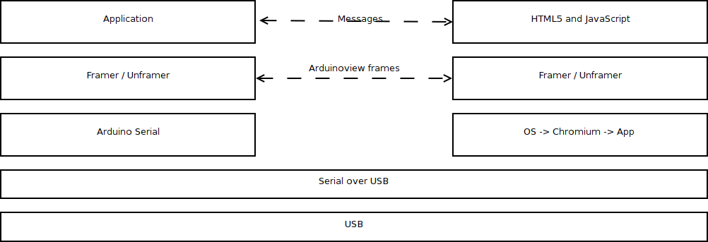
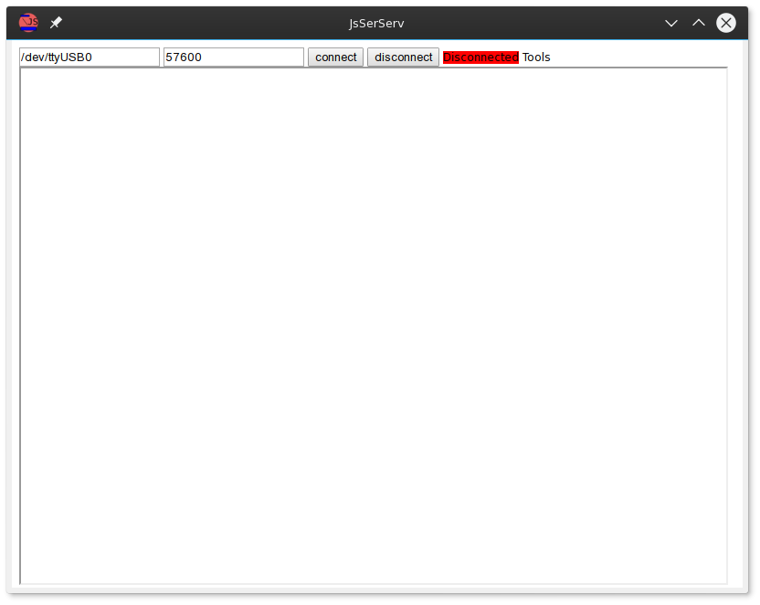
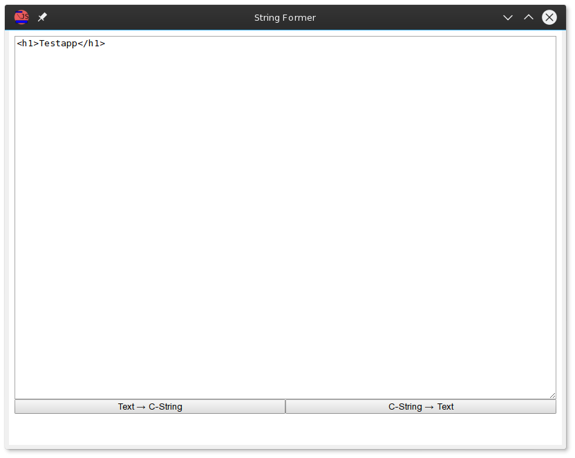

---
toc: true
documentclass: memoir
papersize: a4
geometry: margin=3cm
classoption: oneside
---

# Arduinoview
## Arduinoview in Layers

Despite there are many serial interfaces (like SPI, I2C, USB ... ) this document refers to USART (universal serial asynchronous receiver/transmitter) as
serial interface.

~~~
UI-Elements
HTML5+JavaScript        Application( Events)
Framer(byte-stuffing)----Framer
ChromeApp
Serial------------------Serial
USB
~~~

## The Frame

Each frame provides a determined object of communication -like a sentence in natural language- that can be parsed by the following layer. The framing-layer
ensures that the receiver got the frame from start (which in case of Arduinoview will contain a header) to end or no data. It further ensures that no
code is made illegal by the framing itself, so every byte can be transmitted.

Arduinoview is supposed to run on any Arduino so its interface was chosen to be the USB-Serial interface. The serial interface by itself provides no framing
bigger than one symbol, which consist of one start bit, 5-9 data bits, an optional parity bit and 1-2 stop bits [see for example
https://en.wikipedia.org/wiki/Universal_asynchronous_receiver/transmitter]. There are different approaches to provide something like a
frame on top of the serial interface. A short list of common approaches:

* line terminated: each begin of a new line starts message, new line symbol (carriage return and/or line feed) ends the message this removes the newline
symbol from the list of available characters

* midi message: symbols form 0 - 127 (0x00 - 0x7f) are data symbols , symbols from 127 - 255 (0x80-0xff) are command symbol; each command symbol is followed
by a known number of data symbols depending on the command. this removes half of all codes from the available codes for data transfer.

* counting protocols: either with a constant number of bytes as there will be two byte the first is the command the second is data or with a header that tells
the number of bytes.

* escaping codes: escaping codes chose a escape symbol that changes the interpretation of the next byte, this way control symbols can be introduced without
reducing the available symbol set.

For Arduinoview frames separate start and end symbols and escaping was chosen. Each frame begins with a start-of-frame symbol (0x01) contains any number of
data bytes and finishes with an end-of-frame symbol (0x04). data-bytes are any byte but start-of-frame, end-of-frame or escape, these bytes are encoded by
escape symbol (0x10) and themselves being xord with the escape-mask ( SOF will be 0x10 0x41(A), EOF will be 0x10 0x44(D), ESC will be 0x10 0x50(P) ). The codes
where chosen from the control character region of the ASCII-character set to avoid escaping inside the frame.

~~~ Definition
<Frame>     : <SOF><DATA><EOF>
<SOF>       : 0x01
<EOF>       : 0x04
<ESC>       : 0x10
<ESCMASK>   : 0x40
<DATA>      : <SYMBOL>
<DATA>      : <SYMBOL><DATA>
<SYMBOL>    : <DATAOCTET>
<SYMBOL>    : <ESC><DATAOCTET> // <DATAOCTET> <= <ESCMASK> xor Messagebyte
<DATAOCTET> : 0x00 - 0xff but {<SOF>,<EOF>,<ESC>}
~~~

## Arduinoview Message
Arduinoview builds on top of the framing layer, it defines a message as being 2 header-bytes + a number of data-bytes. The header-bytes address the parser
(later named runner) for the rest of the message on the receiving device, predefined parsers start with an exclamation mark (! = 0x21 ). Other parser may
be defined by the user preferably using ASCII characters (0x21 to 0x7e).

~~~ Definition
<Message>   : <HEAD><DATA>
<HEAD>      : <BYTE><BYTE>
<DATA>      : <BYTES>
<BYTES>     : <BYTE><BYTES>
<BYTES>     :
<BYTE>      : 0x00-0xff
~~~

## Talking JavaScript

Since Arduinoview runs inside the JavaScript environment of the browser app the first idea was to run every message with the eval(), but this had some
limitations that made using this very difficult. To simplify the communication to Arduinoview the runner concept was added. Runners are functions that,
interpret a string. They are addressed by the first two bytes at the begin of the framed message a global object within JavaScript that is called "runner" is
used like a dictionary to achieve this. To run JavaScript code the message should start with "!j" everything after this will be evaluated by using
JavaScript's eval(). Runner may be added by the user by defining a function that takes a string and processes it.

~~~
<JavaScript Frame> : !j<JavaScript Code>

~~~

This Example will be processed as JavaScript. It defines a function noI that removes all "i" from the message and appends it to the HTML. This function is
then bound to the runner "ni".

~~~{.javascript}
!j
function noI(str){
    HTMLappend(str.replace(/i/i,""));
}
runner["ni"]=noI;
~~~

## Javascript commands

    HTMLreplace(x)
: replaces the innerHTML of the current work-element

    HTMLappend(x)
: creates an temporary div replaces its innerHTML and than transfers appends every node inside that div to the current work-element

    sendraw(msg)
: sends a message to the Arduino using the hosts connection sendraw instructs the host to not pack a frame the message-string will be send byte by byte

    sendframe(msg)
: sends a message to the Arduino using the hosts connection sendframe instructs the host to pack a frame

    alert = function ERROR(msg)
: displays a red div to show errors and alerts

    loadjsfile(filename, onload)
: loads javascript-files by adding a script element to the head; see autoloader

    autoloader(filename,onload)
: this serializes the loading of multiple js files to avoid race-condition

    loadcssfile(filename)
: loads css-files by adding a style element to the head

    beep()
: sounds a beep

    receiveMessage(event)
: receives the messages from the host window runs the matching runner

    object: runner[]
: associative array that maps runner id to the matching function

    runner['!!']
: reload/resets sandbox

    runner.append(obj)
: appends an object / dictionary to the runner list

## Talking HTML

Arduinoview uses HTML as its description language for the GUI, this was chosen since it is well known to many people.  A HTML frame begins with either "!h" to
replace the innerHTML of the current work-element or "!H" to append to the innerHTML. The work-element is chosen by the runner "!w".

~~~
<HTMLreplace Frame> : !h<HTML Code>
<HTMLappend Frame>  : !H<HTML Code>
<Workelement Frame> : !w<workelement by id,IDs[] or nothing to select the body-element>
~~~

Example: each one is a message

~~~
!h

~~~
creates three divs: head main and foot

~~~
!wmain
~~~
switches workelement to the "main" div

~~~
!hthisis the main part of the UI  it may have <input type="Button" value="Button" onclick="sendframe("cc")>
~~~
overwrites the innerHTML of the "main" element

~~~
!Hwhich will send a frame containing "cc" to the Arduino.
~~~
adds more contend to the main div

~~~
!whead
~~~
switches workelement to the "head" div

~~~
!hby switching to head it might be modifyed
~~~
adds contend to the head div

## Talking Arduinoview shorthand

Arduinoview shorthand provides some graphical "standard" elements through the
runner "!S". It suffers from the problem of Arduviz an Guino in that it provides
only a set of GUI elements. Each element is represented by a character which is
followed by a 2 byte ID that is written to the IDs array and can be
accessed by the workelement object.

~~~
<Shorthand Frame>   : !S<E><ID><DATA>
<E>                 : <Character>
<ID>                : <Character><Character>
<Data>              : < ! separated Information >
~~~

interpretation of E

| Shorthand | Description                                                                                              |
| --------- | -------------------------------------------------------------------------------------------------------- |
| l         | adds a line break                                                                                        |
| b         | adds a Button <DATA> value will be interpreted as Caption; onclick it will send g  its 2 byte ID         |
| p         | adds a color-Picker <DATA> value will be interpreted as hex string; onclick it will send g its 2 byte ID |
| s         | adds a slider (range); onchange it will send !g + its 2 byte ID + it value (0-255)                       |
| c         | adds a checkbox; onchange it will send !g + its 2 byte ID + its value (t or f)                           |
| G         | adds a graph using the eCharts library (defaults to a moving Graph)                                      |
| t         | adds a textinput; onchange it will send !g + its 2 byte ID + its value                                   |
| d         | adds a div block that is styled as a inline block                                                        |

interpretation of DATA

the Data is partitioned by ! and each part is interpreted by its first character

| character | interpretation                                |
| --------- | --------------------------------------------- |
| s         | css style the element                         |
| w         | css width                                     |
| h         | css height                                    |
| v         | value (interpretation depends on the Element) |

Example: consecutive Frames

~~~
!Sdlew49%
~~~
adds a div with a width of 49% with the IDs[] entry "le"

~~~
!Sdriw49%
~~~
adds a div with a width of 49% with the IDs[] entry "ri"

The two div will be side by side.

~~~
!wle
~~~
switch to the left div

~~~
!SMgl
~~~
adds a moving graph to the left div with the IDs[] entry "gl" without further attributes it defaults to 100% width and 20em height

~~~
!wri
~~~
switch to the right div

~~~
!SGgrw80%!h300px
~~~
adds a not moving graph to the right div with the IDs[] entry "gr" its width will be 80% of the right div and its height 300px

The graphs may now be filled with Data, this can be done by either accessing the plot container via JavaScript GUI-data runner of the Graph '!d'.

~~~
!dgr100,200
~~~

writes the values 100 and 200 to the GUI Elemet gr, the graph will interprete them as values to be attached to the graph.

## The UI

### Main UI

{ width=66% }

The Main UI consists of two parts the host window and the application sandbox, a frame within the host window. The host window is used to establish the
connection to the Arduino, while the sandbox frame contains the GUI application create via Arduinoview. If a frame arrives from the Arduino it is decoded by
the host and its content is transferred to the application in the sandbox which interprets the frame contend.

### The Stringformer

{ width=66% }

The Stringformer is a helper page that translates a string into C-string that can be written into the ino code (Arduino sketch).

Example:

~~~ {.javascript width=48%}
function hello(){
    HTMLappend("<h1>Hello World</h1>")
    }
~~~

will become:

~~~ {.c width=48%}
"function hello(){\n"
"HTMLappend(\"<h1>Hello World</h1>\")\n"
"}\n"
~~~

# The Arduino library

The Arduino library provided with Arduinoview provides several possibilities to communicate to the PC-App. It's kept simple avoiding advance C++ and C
constructions to make it easy to read for beginners in C and C++.

## The Frameiterator.h

The Frameiterator.h file provide two classes, one is StringtoFrame which transforms several types of Strings to a Frame, the other one is the Framereader
that takes byte by byte input of a frame and transforms it back to message.

StringtoFrame has very low memory requirements since it uses the input String itself while iterating over its content, internal variables contain the just
some information about the type and length of the input and the current state of the iterator. StringtoFrame has several constructors and matching addString
functions.

    #define StrInt( Str )
:helps casting a strings content to a uint16_t

    addString / StringtoFrame(const char* str)
:will convert a regular zero terminated C string

    addString / StringtoFrame(PGM_P str_p, char* mark)
:will convert a Program Memory String, mark will be ignored it just selects the right function.

    addString / StringtoFrame(const char* str, size_t length)
:will convert a byte array of the specified length

    addString / StringtoFrame(const uint16_t val, size_t  length )
:will convert up to two bytes

    char next()
:gets the next byte that should transferred

    bool done()
:returns true if the current part of the frame is complete

    bool end()
:returns true if the current (last) part of the frame is complete and tells StringtoFrame to end the frame

    begin()
:resets the Frameitrator for a new frame

Usage:

~~~{.c}
StringtoFrame I = StringtoFrame("!Htest");
while(!I.end())Serial.write(I.next());
~~~

transfers a frame containing "!Htest" (append test to the innerHTML of the
current workelement)

~~~{.c}
// in global context requirement by the pgmspace.h library
const char test_p[] PROGMEM = "!H"
"<h1> Heading ";

// in a function
StringtoFrame I = StringtoFrame(tesp_p,"");
while(!I.done())Serial.write(I.next());

// some thing that generates char * cstr

StringtoFrame I = StringtoFrame(cstr);
while(!I.done())Serial.write(I.next());

StringtoFrame I = StringtoFrame("</h1>");
while(!I.end())Serial.write(I.next());
~~~

transfers a frame containing "!H<h1> Heading " + cstr + "</h1>"  (append a heading to the innerHTML of the current workelement)

Framereader has higher memory requirements since it needs its own buffer to buffer the message until it is complete this buffer defaults to 200 bytes that
may be changed by defining FRAMEREADERSIZE before including Frameiterator.h.

Framereaders functions:

    size_t put(char c)
:puts c into the framereaders which will parsed as required by the frameing protocol returns the current number of byte in the buffer or 0 if the frame is
larger than Framereaders buffer or the frame is complete but not yet cleared.

    size_t length()
:returns 0 until there is a complete message buffer else it returns the size of the message in buffer.

    char * frame()
:returns 0 until there is a complete message buffer else it returns a pointer to the message.

    void clearframe()
:clears the current frame makes Framereader availible to receive a new message

Usage:

~~~{.c}
static Framereader frm_in;
while(Serial.available()){
    frm_in.put(Serial.read());
    if(frm_in.length() != 0){
            //interpret frame (frm_in.frame(),frm_in.length());
        frm_in.clearframe();
    }
}
~~~
declare an construct a static Framereader object check Serial interface for availible bytes, if there are bytes read them and if a frame is complete
interpret it (interpretation has to be done by the user since this is the frameing layer)

## FrameStream.h

FrameStream implements the Stream interface of th Arduino libraries to sensible level (Print) and abstracts from the Frameiterator.

FrameStream function:

    FrameStream(Stream &serial)
:constructs a FrameStream using that will use the specified Stream (serial interface)

    size_t write(uint8_t c)
:write c to the Frame; Frame will be automatically started

    size_t write(const uint8_t *buffer, size_t size)
:writes size bytes from the buffer to the Frame; Frame will be automatically started

    end()
:ends the current frame

    bool run()
:reads a byte from the Stream and starts the interpretation of the frame if it is complete. interpretation is done by the eventlist(Framereader&).

Print class defines further print functions that are documented at "https://www.arduino.cc/en/Reference/Serial" print() is availible for

    (char *)
    (String &)
    (int), (unsingend int)
    (char), (usingend char),
    (double),
    (_FlashStringHelper)

Example:

~~~{.c}
// global
FrameStream frm(Serial);

//in setup function
const __FlashStringHelper * startpage = F("!h<h1 onclick=sendframe('!bc')>Click Me</h1>");
frm.print(startpage);
frm.end();

//in loop
frm.run();
~~~
initializes a FrameStream transfer startpage with a Click Me Heading to the PC.

~~~{.c}
void alert( char * str){
    frm.print(F("!jalert(\""));
    frm.print(str);
    frm.print(F("\");"));
    frm.end();
}
~~~
calls JavaScript's alert() function

Runnerlist:

Runnerlist is a function that may be constructed by using following macros, it will contain an if for every function that is assigned to a specific runner.

    #define beginrunnerlist(NAME)
starts a runnerlist, the is put in front of runnerlist(char* str , size_t length) FrameStream::run runs Runnerlist with empty NAME.

    #define runner(ID,runner_function)
adds a runner if statement to the runnerlist function that will run runner_function(char * str, size_t size) if triggered

    #define fwdrunner(ID,runner_function)
adds a runner if statement to the runnerlist function that will run runner_function(char * str, size_t size) if triggered, with * str pointing behind the ID.

    #define callrunner(ID,runner_function)
adds a runner if statement to the runnerlist function that will run runner_function()  if triggered, without any paramters.

    #define endrunnerlist()
ends the runnerlist function

Example:

~~~{.c}
declarerunnerlist(GUI);

beginrunnerlist();
callrunner(!!,gui_init);
runner(BB,test);
fwdrunner(!g,GUIrunnerlist}
endrunnerlist();
~~~
creates a runnerlist function that will call gui_init() if "!!" is at the head of the frame and test(char*, size_t) if "BB" is at the head of the
frame. If !g is at the head of the frame GUIrunnerlist GUIrunnerlist will be called, removing the !G id from the string for further processing.

~~~{.c}
beginrunnerlist(GUI);
endrunnerlist();
~~~
creates a runnerlist function.
